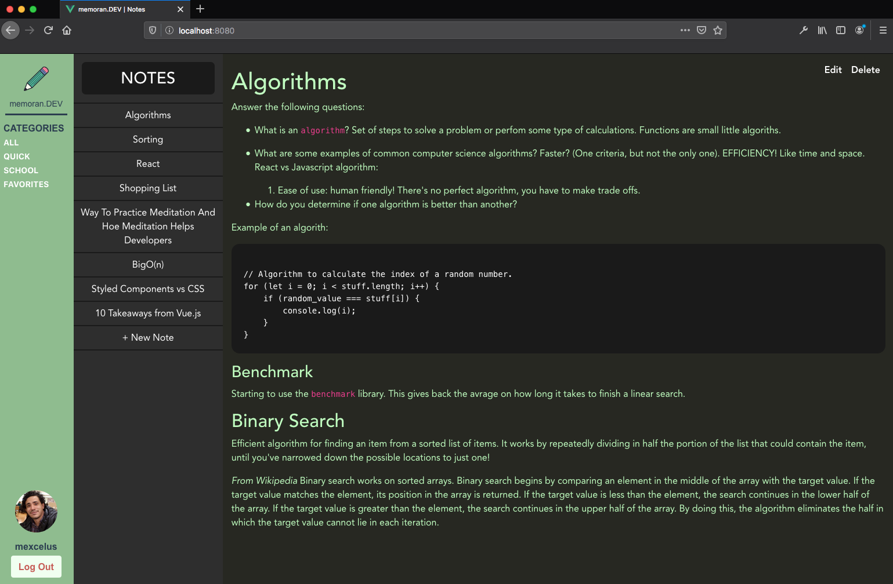

<p align="center" style="margin:0;">
    
    <h1 align="center" style="font-size:26px;font-weight:bolder">memoran.dev</h1>
</p>

<p align="center" style="margin:0;">
    
</p>

<p align="center">
    A web-based note-taking application built in vue.js
</p>



## Project setup
```
yarn install
```

### Compiles and hot-reloads for development
```
yarn serve
```

### Compiles and minifies for production
```
yarn build
```

### Lints and fixes files
```
yarn lint
```

### Customize configuration
See [Configuration Reference](https://cli.vuejs.org/config/).
